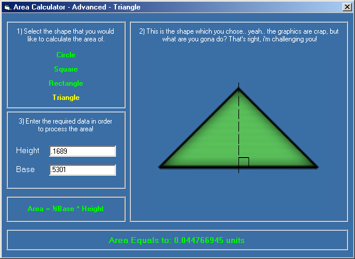



## Area Calculator 2 \(More advanced\)

### Description

To calculate the area of a circle, triangle, rectangle and a square. This application is a bit more advanced where I use images instead of picture boxes and I make it more neater. I also added a common triangle.
 
### More Info
 

             |
---                |---
**Submitted On**   |2000-12-19 21:23:12
**By**             |[Vlad Stanculescu](https://github.com/Planet-Source-Code/PSCIndex/blob/master/ByAuthor/vlad-stanculescu.md)
**Level**          |Beginner
**User Rating**    |4.3 (17 globes from 4 users)
**Compatibility**  |VB 3\.0, VB 4\.0 \(16\-bit\), VB 4\.0 \(32\-bit\), VB 5\.0, VB 6\.0
**Category**       |[Complete Applications](https://github.com/Planet-Source-Code/PSCIndex/blob/master/ByCategory/complete-applications__1-27.md)
**World**          |[Visual Basic](https://github.com/Planet-Source-Code/PSCIndex/blob/master/ByWorld/visual-basic.md)
**Archive File**   |[CODE\_UPLOAD1283312192000\.zip](https://github.com/Planet-Source-Code/vlad-stanculescu-area-calculator-2-more-advanced__1-13675/archive/master.zip)

